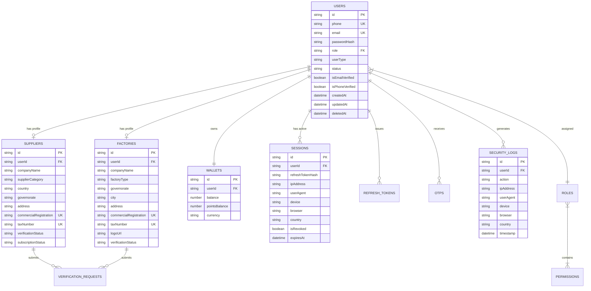
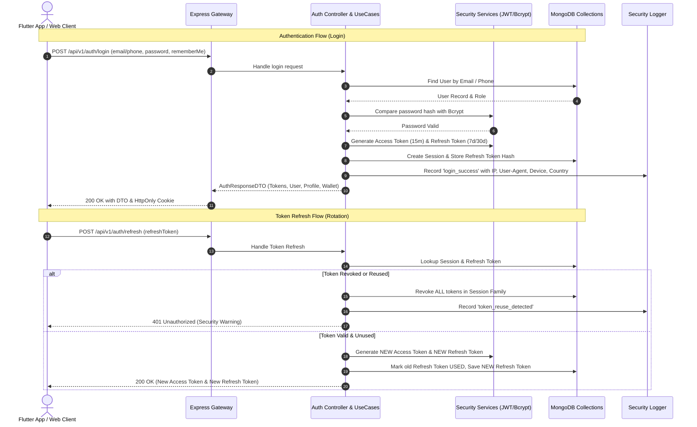

# NASEEJI B2B Marketplace - Enterprise Authentication & Identity Module

## Overview & Architecture Goals
The NASEEJI B2B Textile Marketplace requires a high-throughput, secure, enterprise-grade Authentication & Identity module. The backend is built with **Node.js, Express, MongoDB (Mongoose), TypeScript, and Clean Architecture**, while the mobile/web frontend is built with **Flutter, Riverpod, Dio, and Flutter Secure Storage**.

This plan outlines the complete implementation across all layers, collections, use cases, API endpoints, security mechanisms, Flutter client integration, Postman collection, Swagger documentation, and automated testing suite.

---

## Technical Stack & Clean Architecture

### Backend (Node.js + Express + TypeScript + Mongoose + Redis)
- **Domain Layer**: Core entities (`User`, `Factory`, `Supplier`, `Wallet`, `Role`, `Permission`, `Session`, `RefreshToken`, `VerificationRequest`, `OTP`, `SecurityLog`), value objects, domain errors.
- **Application Layer**: DTOs, Use Cases, Interfaces (Repositories, Token Service, Password Service, Fingerprint/UserAgent Parser, OTP Provider).
- **Infrastructure Layer**: Mongoose Schemas & Models, Repository Implementations, Bcrypt, JWT Rotation Engine, Rate Limiters, Helmet, CORS, Input Sanitizer, Express Middlewares.
- **Presentation Layer**: Express Controllers, Route handlers (`/api/v1/auth`, `/api/v1/admin/verification`), Swagger OpenAPI specifications.

### Flutter (Dart + Riverpod + Dio + Flutter Secure Storage)
- **Data Layer**: DTOs, Remote Data Source (`AuthRemoteDataSource`), Local Storage (`TokenStorageService`), Repository Implementation (`AuthRepositoryImpl`).
- **Domain Layer**: Entities, Repositories Contracts, Use Cases (`LoginUseCase`, `RegisterFactoryUseCase`, `RegisterSupplierUseCase`, `RefreshTokenUseCase`, `CheckAuthStatusUseCase`, etc.).
- **Presentation Layer**: Auth Notifiers (`StateNotifier` / Riverpod), Auth State (`AuthUnauthenticated`, `AuthAuthenticated`, `AuthVerificationPending`, `AuthLoading`), Navigation Guard (Splash -> Auth Check -> Role Router).

---

## User Review Required

> [!IMPORTANT]
> - **Roles & Permissions System**: Pre-populated RBAC Matrix with 5 roles (`factory`, `supplier`, `admin`, `support`, `auditor`) and granular permission flags (`auth:read`, `factory:write`, `supplier:verify`, `admin:full`, `logs:read`).
> - **Refresh Token Rotation & Reuse Detection**: If a revoked or already used refresh token is presented, all refresh tokens in that token family/session will be immediately invalidated to mitigate token theft attacks.
> - **Soft Deletion Policy**: Account deletion sets `deletedAt`, marks state as `deleted`, and immediately revokes all active sessions without deleting historical transaction or order data.

---

## Proposed Changes & File Layout

### Backend Component (`c:/flutter pro/Naseeji/backend`)

#### Core & Shared Layer
- [NEW] [user.entity.ts](file:///c:/flutter%20pro/Naseeji/backend/src/modules/auth/domain/entities/user.entity.ts)
- [NEW] [factory.entity.ts](file:///c:/flutter%20pro/Naseeji/backend/src/modules/auth/domain/entities/factory.entity.ts)
- [NEW] [supplier.entity.ts](file:///c:/flutter%20pro/Naseeji/backend/src/modules/auth/domain/entities/supplier.entity.ts)
- [NEW] [wallet.entity.ts](file:///c:/flutter%20pro/Naseeji/backend/src/modules/auth/domain/entities/wallet.entity.ts)
- [NEW] [role.entity.ts](file:///c:/flutter%20pro/Naseeji/backend/src/modules/auth/domain/entities/role.entity.ts)
- [NEW] [session.entity.ts](file:///c:/flutter%20pro/Naseeji/backend/src/modules/auth/domain/entities/session.entity.ts)
- [NEW] [verification-request.entity.ts](file:///c:/flutter%20pro/Naseeji/backend/src/modules/auth/domain/entities/verification-request.entity.ts)

#### Mongoose Schemas & Database Collections
- [NEW] [user.schema.ts](file:///c:/flutter%20pro/Naseeji/backend/src/modules/auth/infrastructure/database/user.schema.ts)
- [NEW] [factory.schema.ts](file:///c:/flutter%20pro/Naseeji/backend/src/modules/auth/infrastructure/database/factory.schema.ts)
- [NEW] [supplier.schema.ts](file:///c:/flutter%20pro/Naseeji/backend/src/modules/auth/infrastructure/database/supplier.schema.ts)
- [NEW] [wallet.schema.ts](file:///c:/flutter%20pro/Naseeji/backend/src/modules/auth/infrastructure/database/wallet.schema.ts)
- [NEW] [role.schema.ts](file:///c:/flutter%20pro/Naseeji/backend/src/modules/auth/infrastructure/database/role.schema.ts)
- [NEW] [permission.schema.ts](file:///c:/flutter%20pro/Naseeji/backend/src/modules/auth/infrastructure/database/permission.schema.ts)
- [NEW] [session.schema.ts](file:///c:/flutter%20pro/Naseeji/backend/src/modules/auth/infrastructure/database/session.schema.ts)
- [NEW] [refresh-token.schema.ts](file:///c:/flutter%20pro/Naseeji/backend/src/modules/auth/infrastructure/database/refresh-token.schema.ts)
- [NEW] [verification-request.schema.ts](file:///c:/flutter%20pro/Naseeji/backend/src/modules/auth/infrastructure/database/verification-request.schema.ts)
- [NEW] [otp.schema.ts](file:///c:/flutter%20pro/Naseeji/backend/src/modules/auth/infrastructure/database/otp.schema.ts)
- [NEW] [security-log.schema.ts](file:///c:/flutter%20pro/Naseeji/backend/src/modules/auth/infrastructure/database/security-log.schema.ts)

#### Validation Layer (Zod Schemas)
- [NEW] [auth.validators.ts](file:///c:/flutter%20pro/Naseeji/backend/src/modules/auth/presentation/validators/auth.validators.ts) (Register Factory, Register Supplier, Login, Forgot Password, Reset Password, OTP, Change Password, Deactivate)

#### Use Cases (Application Layer)
- [NEW] [register-factory.usecase.ts](file:///c:/flutter%20pro/Naseeji/backend/src/modules/auth/application/usecases/register-factory.usecase.ts)
- [NEW] [register-supplier.usecase.ts](file:///c:/flutter%20pro/Naseeji/backend/src/modules/auth/application/usecases/register-supplier.usecase.ts)
- [NEW] [login.usecase.ts](file:///c:/flutter%20pro/Naseeji/backend/src/modules/auth/application/usecases/login.usecase.ts)
- [NEW] [logout.usecase.ts](file:///c:/flutter%20pro/Naseeji/backend/src/modules/auth/application/usecases/logout.usecase.ts)
- [NEW] [refresh-token.usecase.ts](file:///c:/flutter%20pro/Naseeji/backend/src/modules/auth/application/usecases/refresh-token.usecase.ts)
- [NEW] [forgot-password.usecase.ts](file:///c:/flutter%20pro/Naseeji/backend/src/modules/auth/application/usecases/forgot-password.usecase.ts)
- [NEW] [reset-password.usecase.ts](file:///c:/flutter%20pro/Naseeji/backend/src/modules/auth/application/usecases/reset-password.usecase.ts)
- [NEW] [change-password.usecase.ts](file:///c:/flutter%20pro/Naseeji/backend/src/modules/auth/application/usecases/change-password.usecase.ts)
- [NEW] [verify-email-phone.usecase.ts](file:///c:/flutter%20pro/Naseeji/backend/src/modules/auth/application/usecases/verify-email-phone.usecase.ts)
- [NEW] [session-management.usecase.ts](file:///c:/flutter%20pro/Naseeji/backend/src/modules/auth/application/usecases/session-management.usecase.ts)
- [NEW] [account-lifecycle.usecase.ts](file:///c:/flutter%20pro/Naseeji/backend/src/modules/auth/application/usecases/account-lifecycle.usecase.ts)
- [NEW] [supplier-verification.usecase.ts](file:///c:/flutter%20pro/Naseeji/backend/src/modules/auth/application/usecases/supplier-verification.usecase.ts)

#### Presentation Layer (Controllers & Routes)
- [NEW] [enterprise-auth.controller.ts](file:///c:/flutter%20pro/Naseeji/backend/src/modules/auth/presentation/controllers/enterprise-auth.controller.ts)
- [NEW] [verification.controller.ts](file:///c:/flutter%20pro/Naseeji/backend/src/modules/auth/presentation/controllers/verification.controller.ts)
- [NEW] [enterprise-auth.routes.ts](file:///c:/flutter%20pro/Naseeji/backend/src/modules/auth/presentation/routes/enterprise-auth.routes.ts)
- [NEW] [rbac.middleware.ts](file:///c:/flutter%20pro/Naseeji/backend/src/middleware/rbac.middleware.ts)

---

### Flutter Component (`c:/flutter pro/Naseeji/naseeji_factory_supplier`)

- [NEW] [user_model.dart](file:///c:/flutter%20pro/Naseeji/naseeji_factory_supplier/lib/authentication/data/models/user_model.dart)
- [NEW] [factory_profile_model.dart](file:///c:/flutter%20pro/Naseeji/naseeji_factory_supplier/lib/authentication/data/models/factory_profile_model.dart)
- [NEW] [supplier_profile_model.dart](file:///c:/flutter%20pro/Naseeji/naseeji_factory_supplier/lib/authentication/data/models/supplier_profile_model.dart)
- [NEW] [wallet_model.dart](file:///c:/flutter%20pro/Naseeji/naseeji_factory_supplier/lib/authentication/data/models/wallet_model.dart)
- [NEW] [auth_tokens_model.dart](file:///c:/flutter%20pro/Naseeji/naseeji_factory_supplier/lib/authentication/data/models/auth_tokens_model.dart)
- [NEW] [token_storage_service.dart](file:///c:/flutter%20pro/Naseeji/naseeji_factory_supplier/lib/authentication/data/datasources/token_storage_service.dart)
- [NEW] [auth_remote_data_source.dart](file:///c:/flutter%20pro/Naseeji/naseeji_factory_supplier/lib/authentication/data/datasources/auth_remote_data_source.dart)
- [NEW] [auth_repository.dart](file:///c:/flutter%20pro/Naseeji/naseeji_factory_supplier/lib/authentication/domain/repositories/auth_repository.dart)
- [NEW] [auth_repository_impl.dart](file:///c:/flutter%20pro/Naseeji/naseeji_factory_supplier/lib/authentication/data/repositories/auth_repository_impl.dart)
- [NEW] [auth_state.dart](file:///c:/flutter%20pro/Naseeji/naseeji_factory_supplier/lib/authentication/presentation/providers/auth_state.dart)
- [NEW] [auth_notifier.dart](file:///c:/flutter%20pro/Naseeji/naseeji_factory_supplier/lib/authentication/presentation/providers/auth_notifier.dart)
- [NEW] [splash_auth_guard.dart](file:///c:/flutter%20pro/Naseeji/naseeji_factory_supplier/lib/authentication/presentation/screens/splash_auth_guard.dart)

---

### Documentation & Deliverables Layer
- [NEW] [swagger.json](file:///c:/flutter%20pro/Naseeji/backend/src/docs/swagger.json)
- [NEW] [naseeji_auth_postman_collection.json](file:///c:/flutter%20pro/Naseeji/docs/naseeji_auth_postman_collection.json)
- [NEW] [architecture_and_er_diagrams.md](file:///c:/flutter%20pro/Naseeji/docs/architecture_and_er_diagrams.md)

---

## Database ER Diagram & Collection Relationships

---

## Authentication & Authorization Sequence Diagram

---

## Verification Plan

### Automated Tests
- **Backend Unit Tests**: Jest tests for password hashing, JWT creation & verification, Zod validation rules, Session revoking logic.
- **Backend Integration Tests**: Supertest suite for API endpoints (`/register/factory`, `/register/supplier`, `/login`, `/logout`, `/refresh`, `/verify-otp`, `/sessions`, `/security-logs`).
- **Flutter Unit Tests**: Dart unit tests for `AuthNotifier`, `AuthRepositoryImpl`, `TokenStorageService`.

### Manual & Security Verification
- Verify rate limiting response headers and HTTP 429 status code on consecutive failed logins.
- Test refresh token reuse detection: re-play an already rotated refresh token and verify all user sessions are automatically revoked.
- Verify role-based access middleware returns 403 Forbidden for unauthorized endpoints.
- Check Swagger UI endpoint at `http://localhost:5000/api/docs`.
