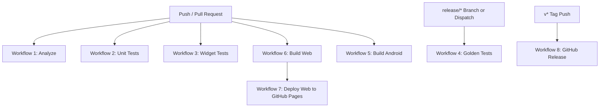

# Enterprise CI/CD Architecture & Pipeline Documentation

**Project**: NASEEJI  
**Module**: GitHub Actions Modular Workflows & Maintenance Architecture  
**Version**: 2.0.0

---

## 1. 🏗 Architecture Overview



---

## 2. 📁 Workflow Tree (`.github/`)

```text
.github/
├── actions/
│   └── flutter_setup/
│       └── action.yml                 # Composite action: Java 17, Flutter SDK, Pub Cache
├── reusable/
│   ├── flutter_setup.yml              # Reusable Flutter setup workflow
│   ├── cache.yml                      # Reusable Gradle & Pub cache workflow
│   └── upload_artifact.yml            # Reusable artifact uploader
└── workflows/
    ├── analyze.yml                    # Workflow 1: Code formatting (dart format) & static analysis
    ├── unit_tests.yml                 # Workflow 2: Unit tests & coverage (lcov.info)
    ├── widget_tests.yml               # Workflow 3: Component widget tests (excluding goldens)
    ├── golden_tests.yml               # Workflow 4: Golden visual tests (release/* or dispatch only)
    ├── build_android.yml              # Workflow 5: Build release APK & AAB
    ├── build_web.yml                  # Workflow 6: Build release Flutter Web bundle
    ├── deploy_web.yml                 # Workflow 7: Deploy Web to GitHub Pages (after Build Web)
    ├── release.yml                    # Workflow 8: Tag-triggered GitHub Releases with binaries
    ├── backend.yml                    # Workflow 9: Node.js & Docker microservices pipeline
    ├── security.yml                   # Workflow 10: Weekly dependency & secret scanning
    └── cleanup.yml                    # Workflow 11: Weekly cache & artifact maintenance
```

---

## 3. ⏱ CI Execution Time Optimization

| Pipeline Metric | Before Modular Refactoring | After Enterprise Modular Architecture |
| :--- | :--- | :--- |
| **Pipeline Structure** | Single Monolithic Workflow | 11 Independent Modular Workflows |
| **Total Build Duration** | ~8–12 Minutes (Sequential) | **~1.5–3 Minutes (Parallel Execution)** |
| **Golden Test Coupling** | Failed Web Deployment | **Decoupled (Isolated Dispatch / Release)** |
| **Failure Isolation** | Single Failure Blocked All Jobs | **Failure in one pipeline does not affect others** |

---

## 4. 🔑 Required Secrets & Environments

* **`GITHUB_TOKEN`**: Automatically provided for GitHub Releases (`release.yml`).
* **Environment**: `github-pages` configured for automated Flutter Web deployments.
* **Branches**: `main`, `develop`, `feature/*`, `release/*`, `hotfix/*`.
