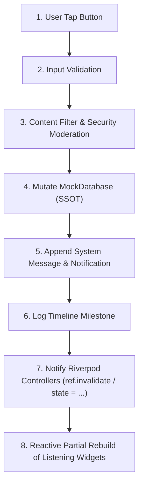

# ⚡ دليل تسلسل الإجراءات والأزرار (Action Flow Documentation)
## تطبيق نسيجي للموردين — NASEEJI Supplier App

---

## 📌 مخطط دورة تنفيذ أي زر في المنصة (Generic Button Action Lifecycle)

---

## 🔘 1. زر "إرسال عرض سعر جديد" (`submitNewOfferVersion`)

### 📥 Inputs:
- `unitPrice` (سعر الوحدة)
- `quantity` (الكمية)
- `productionLeadTime` (مدة الإنتاج)
- `validityPeriod` (صلاحية العرض)
- `paymentTerms` (شروط الدفع)
- `deliveryTerms` (شروط التسليم)
- `notes` (ملاحظات إضافية)

### 🔄 Execution Flow:
1. **Input Validation**: التأكد من أن السعر > 0 والكمية ≥ MOQ وأن جميع الحقول اللازمة مكتملة.
2. **Content Moderation (`ContentModerationService`)**: فحص الملاحظات بحظر الأرقام والإيميلات والروابط والواتساب.
3. **Database Update (`MockDatabase.submitNewOfferVersion`)**:
   - إضافـة `QuotationMock` برقم إصدار فريد (`Version N+1`).
   - تحديث إجمالي قيمة الصفقة وحالتها إلى `awaitingResponse`.
4. **System Message Creation**: إنشاء رسالة كبسولة ملونة بتفاصيل الإصدار الجديد.
5. **Timeline Event**: تسجيل مرحلة جديدة برقم الإصدار والقيمة.
6. **Notification Dispatch**: إرسال إشعار فوري للمصنع بتقديم عرض سعر جديد.
7. **Provider Refresh**: تحديث `dealProvider(dealId)` ومزودي `negotiationProvider` و `dealChatProvider`.
8. **UI Reactive Updates**:
   - **Sticky Header**: تحديث القيمة والكمية والحالة فوراً.
   - **Negotiation Tab**: ظهور كارت العرض الجديد V2 أعلى القائمة.
   - **Messages Tab**: ظهور رسالة النظام التلقائية.
   - **Timeline Tab**: انتقال مؤشر الخط الزمني للإصدار الجديد.
   - **Deals Dashboard**: تحديث بطاقة الصفقة بالقيمة والحالة الجديدة.

---

## 🔘 2. زر "طلب تعديل العرض" (`Request Modification / Counter Offer`)

### 🔄 Execution Flow:
1. **Input Validation**: التحقق من المدخلات المعدلة من قِبل المصنع.
2. **Database Update**:
   - إنشاء كائن `QuotationMock` جديد بحالة `OfferStatus.counterOffer`.
   - إرسال `SystemMessage`: *"طلب المصنع تعديل السعر وميعاد التسليم"*.
3. **Timeline & Notifications**: إضافة حدث للخط الزمني وإرسال إشعار للمورد.
4. **UI Reactive Updates**: تحديث الـ Header، وتبويب التفاوض لإظهار طلب التعديل.

---

## 🔘 3. زر "قبول العرض" (`acceptQuotation`)

### 🔄 Execution Flow:
1. **Database Update (`MockDatabase.acceptQuotation`)**:
   - تحويل حالة الصفقة إلى `DealStatus.agreed`.
   - توليد وثيقة العقد الإلكتروني `AgreementMock` وتوقيعها هيدروليكياً.
2. **System Message**: *"تم قبول عرض السعر رسمياً وإنشاء العقد الإلكتروني الموثق 🟢"*.
3. **Timeline Event**: نقل المؤشر إلى مرحلة *"تم قبول العرض والعقد"*.
4. **Notifications**: إرسال إشعارات توقيع العقد للطرفين.
5. **UI Reactive Updates**:
   - تفعيل تبويب **📄 الاتفاق** وعرض بنود العقد الموثق.
   - تحديث بادج الـ Header إلى `تم الاتفاق`.

---

## 🔘 4. زر "بدأ الإنتاج والتصنيع" (`startProduction`)

### 🔄 Execution Flow:
1. **Database Update**: تحويل الحالة إلى `DealStatus.inProduction`.
2. **System Message**: *"بدأ الإنتاج والتصنيع الفعلي في خطوط مصانع المحلة الكبرى 🏭"*.
3. **Timeline Event**: تفعيل مرحلة التصنيع بالخط الزمني.
4. **UI Reactive Updates**: ظهور زر رفع صور وفيديوهات خط الإنتاج بالشات والملفات.

---

## 🔘 5. زر "رفع ملف / ميديا الإنتاج" (`uploadAttachment`)

### 🔄 Execution Flow:
1. **Validation**: التأكد من نوع الملف (PDF, JPG, MP4) وحجمه.
2. **Database Update**: إضافته في `Deal.files` وكـ `BusinessMessage` ميديا بالشات.
3. **UI Reactive Updates**: ظهور الكتالوج/الشهادة فوراً بتبويب **📁 الملفات** والشات.
