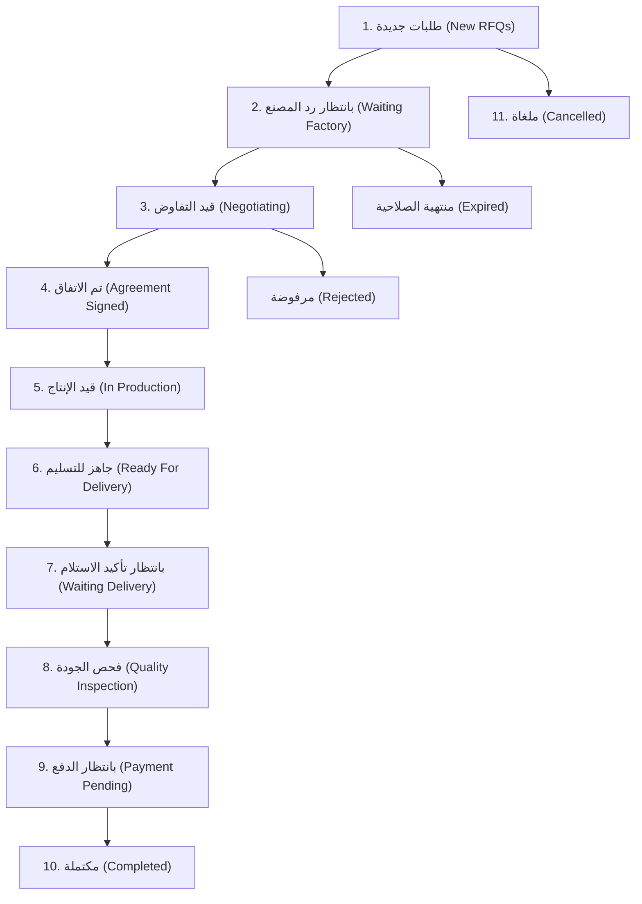

# 🤝 دليل معمارية ودورة عمل الصفقات (Deals Module Business Workflow)
## تطبيق نسيجي للموردين — NASEEJI Supplier App

> [!NOTE]
> قسم الصفقات هو مركز إدارة أعمال المورد بالكامل. جميع الصفقات تمر بدورة حياة موثقة وصارمة، وتعتمد كافة الشاشات على `Deal` كـ **مصدر موحد للحقيقة (Single Source of Truth - SSOT)** عبر الـ `dealId`.

---

## 📌 1. مخطط انتقال وحالات الصفقة الكاملة (State Machine Diagram)



---

## 📋 2. الحالات الـ 11 المعتمدة للصفقة (The 11 System Deal States)

| رقم | اسم الحالة باللغة العربية | الرمز المكتبي (Enum) | الوصف والدورة العملية |
| :---: | :--- | :--- | :--- |
| **1** | **طلبات جديدة** | `newRfq` / `newDeal` | طلب سعر استلم من مصنع ولم يتم الرد عليه من المورد بعد. |
| **2** | **بانتظار رد المصنع** | `awaitingResponse` / `quotationSent` | تم تقديم عرض سعر من المورد وينتظر موافقة/قرار المصنع. |
| **3** | **قيد التفاوض** | `negotiating` | يوجد تبادل عروض أو طلبات تعديل بين المورد والمصنع (V1, V2). |
| **4** | **تم الاتفاق والعقد** | `agreed` / `signed` | قبول العرض المالي وتوقيع الاتفاق الإلكتروني رسمياً. |
| **5** | **قيد الإنتاج** | `inProduction` | المورد بدأ خطوط التصنيع الفلي للمنتج ورفع نسبة الإنجاز. |
| **6** | **جاهز للتسليم** | `readyForShipment` | اكتمال الإنتاج وتحديد مسؤول وموعد التسليم. |
| **7** | **بانتظار تأكيد الاستلام** | `delivering` | الشحنة في الطريق للمصنع وتنتظر تأكيد الاستلام بالمنشأة. |
| **8** | **فحص الجودة المعملية** | `qualityInspection` | استلم المصنع الشحنة وقام ببدء فحص المطابقة والجودة. |
| **9** | **بانتظار الدفع** | `paymentPending` | قبول الجودة المعملية وتجهيز الإفراج المالي. |
| **10** | **مكتملة ومغلقة** | `completed` | تحويل المستحقات لحساب المورد وإغلاق التعامل وتقييم المصنع. |
| **11** | **ملغاة** | `cancelled` | تم إلغاء الصفقة قبل التوقيع مع ذكر سبب الإلغاء. |

---

## ⚖️ 3. قواعد العمل الصارمة (Strict Business Rules)

1. **قاعدة بدء الإنتاج**: لا يُسمح بالنقر على "بدء الإنتاج والتصنيع" إلا بعد اعتماد وتوقيع العقد (`Agreement Signed`).
2. **قاعدة التسليم والشحن**: لا يُسمح بجدولة وتأكيد التسليم إلا بعد اكتمال مرحلة الإنتاج (`In Production`).
3. **قاعدة إتمام الصفقة الإسقاطية**: لا يُسمح بإغلاق الصفقة وتحويل الأموال إلا بعد الموافقة النهائية على الجودة المعملية (`Quality Inspection Approved`).
4. **قاعدة التقييم والمراجعة**: يُسمح بتقييم المصنع والمراجعة فقط بعد وصول الصفقة لحالة `Completed`.
5. **انتهاء الصلاحية والإلغاء**: عند تجاوز مهلة العرض تتحول الحالة تلقائياً إلى `Expired`. وعند الرفض الصريح من أحد الطرفين تتحول إلى `Rejected` أو `Cancelled`.

---

## 🔘 4 & 5. تفاصيل الأزرار والإجراءات داخل كل حالة (Button Action Workflows)

### أ. حالة: طلبات جديدة (New RFQs)
- **زر "تقديم عرض السعر الأول (Quotation)"**:
  - **Input**: السعر للوحدة، الكمية، مدة الإنتاج، شروط التسليم والدفع.
  - **Validation**: السعر > 0، الكمية ≥ MOQ، وتمرير محرك الأمان منع التواصل الخارجي `ContentModerationService`.
  - **Business Rule**: الانتقال لحالة `Waiting Factory`.
  - **Data Update**: إضافة `QuotationMock V1` وتحديث قيمة الصفقة في `MockDatabase`.
  - **System Message**: *"تم تقديم عرض السعر الأول V1 بقيمة XXX ج.م"*.
  - **Notification**: إرسال إشعار للمصنع بتقديم عرض سعر جديد.
  - **Updated Screens**: `DealsDashboardScreen`, `BusinessChatScreen` (Header, NegotiationTab, MessagesTab, TimelineTab).

---

### ب. حالة: قيد التفاوض (Negotiating)
- **زر "إرسال عرض معدل (Version N+1)"**:
  - **Input**: البنود المعدلة من المورد.
  - **Data Update**: إنشاء `QuotationMock V2` برقم إصدار فريد وتحديث `MockDatabase`.
  - **System Message**: *"تم تعديل العرض وإرسال الإصدار V2"*.
  - **Notification**: إرسال إشعار للمصنع بتعديل العرض.

---

### ج. حالة: تم الاتفاق (Agreement Signed)
- **زر "البدء الفعلي لخطوط الإنتاج والتصنيع 🏭"**:
  - **Business Rule**: مسموح فقط إذا كان العقد موقعاً `Agreement Signed`.
  - **Data Update**: تغيير حالة الصفقة إلى `inProduction`.
  - **System Message**: *"بدأ الإنتاج والتصنيع الفعلي في خطوط المصنع 🏭"*.
  - **Timeline Event**: تسجيل مرحلة التصنيع بالخط الزمني.

---

### د. حالة: قيد الإنتاج (In Production)
- **زر "رفع ميديا الإنتاج وتحديث الإنجاز"**:
  - **Input**: اختيار صور وفيديوهات وملاحظات الإنجاز.
  - **Data Update**: إضافة الميديا بـ `Deal.files` والشات.
  - **System Message**: *"تم رفع ميديا جديدة من خطوط الإنتاج"*.

---

### هـ. حالة: جاهز للتسليم (Ready For Delivery)
- **زر "تحديد تفاصيل وموعد التسليم 🚛"**:
  - **Business Rule**: مسموح فقط بعد الانتهاء من الإنتاج.
  - **Data Update**: تحويل الحالة إلى `delivering` وتحديد سائق الشحنة والتوقيت.
  - **Notification**: تنبيه المصنع بموعد وصول الشحنة.

---

### و. حالة: بانتظار الدفع (Payment Pending)
- **زر "الإفراج عن الدفعة وتحويلها للمحفظة 💰"**:
  - **Business Rule**: مسموح فقط بعد قبول فحص الجودة المعملية `Quality Approved`.
  - **Data Update**: تحويل الحالة إلى `completed` وإيداع المبلغ بالكامل بحساب المورد Escrow.
  - **System Message**: *"تم تحويل المستحقات وإغلاق الصفقة بنجاح 🎉"*.

---

## 🗂️ 6 & 7. الأحداث التي تُنشئ System Messages و Notifications

| الحدث البرمجي | رسالة النظام التلقائية (System Message) | الإشعار التلقائي (Notification) |
| :--- | :--- | :--- |
| **استلام طلب RFQ** | تم إنشاء الصفقة تلقائياً بناءً على طلب RFQ | استلام طلب عرض سعر جديد للصفقة |
| **تقديم عرض سعر V1/V2** | تم إرسال عرض سعر جديد (الإصدار V2) | تم تقديم عرض سعر جديد وفي انتظار الرد |
| **توقيع العقد** | تم قبول العرض وإنشاء الاتفاق والعقد الإلكتروني 🟢 | تم قبول العرض المالي وتوقيع العقد |
| **بدء الإنتاج** | بدأ الإنتاج والتصنيع الفعلي بـ خطوط المصنع 🏭 | بدأ تصنيع وتنفيذ طلب الصفقة |
| **تأكيد التسليم** | تم تحديد موعد ومسؤول التسليم للشحنة 🚛 | تم تحديد موعد الشحن والتسليم |
| **قبول الجودة المعملية** | تم قبول الجودة المعملية - سيتم تحويل الأموال | تم قبول الفحص المعملي والجودة بنجاح |
| **تحويل الأموال الإسقاطية** | تم تحويل وتوثيق المستحقات المالية بحسابك 🎉 | تم إيداع المستحقات المالية للصفقة |

---

## 🔄 8 & 9. التحديثات اللحظية ومكونات البطاقة (Deal Card & Reactive UI)

### بطاقة الصفقة الموحدة (Deal Card Widget):
تحتوي كل بطاقة صفقة داخل التطبيق على:
1. رقم الصفقة (`dealId` / `dealNumber`).
2. اسم المصنع (`factoryName`).
3. اسم المنتج والكمية (`productName` & `quantity`).
4. قيمة آخر عرض سعر (`dealValue`).
5. بادج الحالة الحالية مع اللون المميز.
6. وقت آخر تحديث (`formattedLastUpdated`).
7. زر **"فتح الصفقة"** (يفتح نفس الـ Deal Chat الموحد دون تكرار الشاشات).

### التحديث التفاعلي الحركي (Riverpod 2):
تعتمد شاشة الصفقات على `ref.watch(dealsProvider)` وعند تغيير حالة أي صفقة يتم إرسال إشارة استبدال وتحديث جزئي بدون الحاجة لإعادة تحميل التطبيق أو الصفحة بالكامل.

---

## 🧪 10. نتيجة الفحص والتحليل (Flutter Analyze)

```text
Analyzing 5 items...                                            
No issues found! (ran in 36.4s)
```
