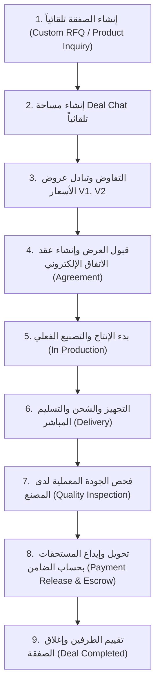
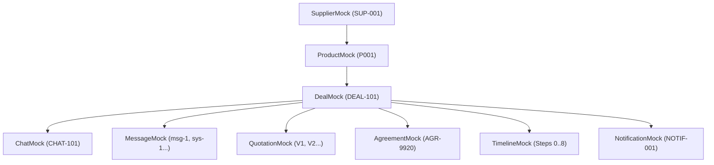

# 🔄 دليل المعمارية ودورة العمل التفاعلية (Mock Workflow Documentation)
## تطبيق نسيجي للموردين — NASEEJI Supplier App

---

## 📌 1. دورة حياة الصفقة (Deal Lifecycle)

تمر كل صفقة داخل منصة نسيجي بسلسلة من المراحل المتكاملة المربوطة بـ `dealId` موحد:

---

## 💬 2. دورة حياة المحادثة (Chat Lifecycle)

- **البدء الآلي**: بمجرد إرسال طلب عرض سعر، يتم توليد شات مخصص مرقم برقم RFQ والصفقة بدون أي تدخل يدوي.
- **التفاعل التكاملي**: تبويب **💬 الرسائل** يخصص للاستفسارات ورسائل النظام التلقائية والميديا (صور، فيديو، PDF).
- **التحديث التفاعلي الحقيقي**: أي إجراء يقوم به المورد أو المصنع (إرسال عرض، طلب تعديل، توقيع عقد) ينشئ **رسالة نظام فوريّـة (`SystemMessage`)** يراها الطرف الآخر داخل المحادثة.

---

## 🤝 3. دورة حياة عرض السعر والتفاوض (Negotiation Workflow)

- **البناء غير النصي**: التفاوض لا يعتمد على نصوص الشات بل يعتمد على بطاقات عروض مستقلة (**Negotiation Cards**).
- **نظام الإصدارات المتعددة (Version History)**:
  - العرض الأول يُنشئ `Version 1`.
  - عند طلب التعديل أو التغير يُنشئ النظام `Version 2` برقم فريد ومستقل مع الاحتفاظ بالنسخ القديمة في **سجل الإصدارات (`OfferHistoryWidget`)**.
- **حالات العرض (`OfferStatus`)**:
  `Draft` ⬅️ `Sent` ⬅️ `Waiting Factory` ⬅️ `Counter Offer` ⬅️ `Accepted` / `Rejected` ⬅️ `Expired`.

---

## 🏭 4. دورة الإنتاج والتصنيع (Production Cycle)

- عند توقيع العقد، يتغير وضع الصفقة إلى `inProduction`.
- يستطيع المورد رفع صور ومقاطع فيديو حية من خطوط الإنتاج تضاف تلقائياً لـ **تبويب الملفات** و **الشات** و **Timeline**.

---

## 🚛 5. دورة التسليم والشحن (Delivery Cycle)

- يحدد المورد مسؤول التسليم وسائق الشحنة والتوقيت المباشر بدون الحاجة لشركة شحن كوسيط.
- تتحول حالة الصفقة إلى `delivering` ثم `delivered`.

---

## 🔬 6. دورة الجودة المعملية (Quality Inspection Cycle)

- بعد استلام الشحنة، يبدأ المصنع فحص المطابقة والجودة المعملية (`qualityInspection`).
- عند القبول ينشئ النظام إشعاراً فورياً بتجهيز تحويل الأموال.

---

## 💰 7. دورة الدفع الضامن الإسقاطي (Payment Escrow Cycle)

- تحول المستحقات بحساب الضامن **Escrow** لحماية المورد والمصنع.
- عند الاعتماد الفني يتحول وضع الصفقة إلى `completed` وإيداع المبلغ بحساب المورد خلال 48 ساعة.

---

## 📊 8. جدول تسلسل الحالات (Status Flow Summary)

| الحالة البرمجية | Label العربي | الوصف والحدث المسبب |
| :--- | :--- | :--- |
| `rfqReceived` | طلب سعر جديد | استلام RFQ جديد وتوليد الصفقة والشات |
| `negotiating` | قيد التفاوض | تبادل الاستفسارات وعروض الأسعار |
| `awaitingResponse` | بانتظار رد المصنع | تقديم عرض سعر وفي انتظار القرار |
| `agreed` | تم الاتفاق والعقد | قبول العرض وتوليد العقد الموثق |
| `inProduction` | قيد الإنتاج | بدء خطوط التصنيع والرفع الفعلي للميديا |
| `readyForShipment` | جاهز للشحن | تجهيز الشحنة وتحديد مسئول التسليم |
| `delivering` | قيد التسليم والترحيل | الشحنة في الطريق للمصنع |
| `delivered` | تم التسليم | استلام الشحنة بمستودع المصنع |
| `completed` | مكتملة ومغلقة | تحويل المستحقات وإغلاق التعامل بالكامل |

---

## 🔔 9 & 10. جدول الأحداث التلقائية (System Messages & Notifications Triggers)

| الحدث والتصرف (Action Trigger) | رسالة النظام التلقائية (System Message) | الإشعار التلقائي (Notification) |
| :--- | :--- | :--- |
| **إنشاء صفقة جديدة** | تم إنشاء الصفقة تلقائياً بناءً على طلب RFQ | استلام طلب عرض سعر جديد للصفقة |
| **إرسال عرض V1/V2** | تم إرسال عرض سعر جديد (الإصدار رقم V2) | تم تقديم عرض سعر جديد وفي انتظار الرد |
| **طلب تعديل من المصنع** | طلب المصنع تعديل السعر وميعاد التسليم | طلب المصنع تعديل العرض الحالي |
| **قبول العرض** | تم قبول العرض وإنشاء الاتفاق والعقد الإلكتروني 🟢 | تم قبول العرض المالي وتوقيع العقد! |
| **بدء الإنتاج** | بدأ الإنتاج والتصنيع الفعلي بـ خطوط المصنع 🏭 | بدأ تصنيع وتنفيذ طلب الصفقة |
| **تحديد موعد التسليم** | تم تحديد موعد ومسؤول التسليم للشحنة 🚛 | تم تحديد موعد الشحن والتسليم |
| **قبول الجودة** | تم قبول الجودة المعملية - سيتم تحويل الأموال | تم قبول الفحص المعملي والجودة بنجاح |
| **إفراج الدفعة المال** | تم تحويل وتوثيق المستحقات المالية بحسابك 🎉 | تم إيداع المستحقات المالية للصفقة |

---

## 🔗 11. مخطط العلاقات بين الموديلات (Entity Relationship Graph)

---

## ⚡ 12. جدول التأثير اللحظي والتفاعلي الشامل (Action → Data Updated → Screens Updated)

| الإجراء (User Action) | البيانات المعدلة في `MockDatabase` | الشاشات المحدثة تلقائياً (Reactive Screens) |
| :--- | :--- | :--- |
| **إنشاء صفقة من منتج** | إضافة `Deal`, `Chat`, `Message`, `Timeline`, `Notification` | `DealsDashboardScreen`, `MessagesScreen`, `BusinessChatScreen`, `NotificationsCenterScreen` |
| **إرسال عرض جديد (V2)** | إضافة `QuotationMock`, تحديث `DealMock`, `SystemMessage`, `Notification` | `BusinessChatScreen` (Header, NegotiationTab, MessagesTab, TimelineTab), `DealsDashboardScreen` |
| **قبول العرض** | تحديث `DealStatus.agreed`, إضافة `AgreementMock`, `SystemMessage`, `Notification` | `BusinessChatScreen` (Header, AgreementTab, MessagesTab, TimelineTab), `DealsDashboardScreen` |
| **بدء الإنتاج** | تحديث `DealStatus.inProduction`, إضافة `SystemMessage`, `Notification` | `BusinessChatScreen` (Header, MessagesTab, TimelineTab), `DealsDashboardScreen` |
| **رفع ميديا وصور** | إضافة `DealFileModel`, `BusinessMessage`, `SystemMessage` | `BusinessChatScreen` (MessagesTab, FilesTab, TimelineTab) |
| **اعتماد التسليم** | تحديث `DealStatus.delivering`, إضافة `SystemMessage`, `Notification` | `BusinessChatScreen` (Header, MessagesTab, TimelineTab), `DealsDashboardScreen` |
| **الإفراج عن الأموال** | تحديث `DealStatus.completed`, إضافة `SystemMessage`, `Notification` | `BusinessChatScreen`, `DealsDashboardScreen`, `SupplierProfileScreen`, `FinancialDashboardScreen` |
