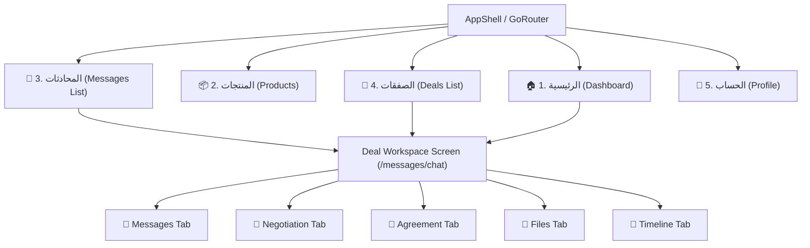

# 🗺️ خريطة وشجرة التنقل داخل التطبيق (Navigation Flow Documentation)
## تطبيق نسيجي للموردين — NASEEJI Supplier App

---

## 📌 مخطط التنقل الرئيسي وشريط التصفح (Bottom Navigation Architecture)

---

## 🗺️ مسارات التنقل بالتفصيل (Route Map)

1. `/dashboard` ⬅️ شاشة الرئيسية والإحصائيات والصفقات النشطة.
2. `/products` ⬅️ قائمة منتجات المورد وخامات القطن والنسيج.
3. `/messages` ⬅️ قائمة المحادثات النشطة المرتبطة بالصفقات.
4. `/messages/chat?dealId=DEAL-101` ⬅️ شاشة التفاوض والشات الموحدة.
5. `/deals` ⬅️ شاشة الصفقات الحالية والمكتملة والمعلقة.
6. `/profile` ⬅️ بيانات المورد والاشتراك والتأكيد والأمان.
