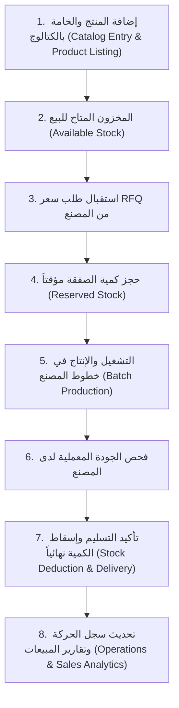

# 📦 دليل معمارية وحركة المنتجات والمخزون للمورد (Product Movement & Inventory Workflow)
## تطبيق نسيجي للموردين — NASEEJI Supplier App

---

## 📌 مخطط دورة حياة المنتج ومراحل المخزون (Product & Stock Lifecycle Graph)



---

## 🚀 المراحل الخمس الرئيسية لحركة منتجات المورد

### 1. مرحلة إدراج الخامة والعرض (Product Listing & Catalog Registration)
- **المدخلات**: اسم الخامة، التصنيف (خيوط قطن، بوليستر، أقمشة)، سعر الوحدة (ج.م/كجم)، الحد الأدنى للطلب (MOQ)، والكمية المتوفرة بالمخازن (`availableStock`).
- **المرفقات الفنية**: رفع الكتالوج الفني، الشهادات المعملية، وشهادة الـ ISO.
- **الحالة الأيضية**: يصبح المنتج **نشطاً ومتاحاً (`isAvailable: true`)** في سوق البورصة والمصانع.

---

### 2. مرحلة طلب عرض السعر والحجز المؤقت (RFQ & Stock Reservation)
- عند اختيار المصنع لمنتج محدد وإرسال طلب عرض سعر **RFQ**:
  - يتم إنشاء صفقة جديدة `Deal` مربوطة بـ `productId` ومورد الصفقة `supplierId`.
  - تحجز الكمية المطلوبة مؤقتاً لحماية المورد والمصنع من نفاذ المخزون غير المتوقع.

---

### 3. مرحلة التفاوض، التصنيع والتعبئة (Negotiation & Production Movement)
- يتبادل المورد والمصنع عروض الأسعار `Version 1` و `Version 2`.
- عند توقيع العقد، يتغير وضع المنتج والصفقة إلى **قيد التصنيع والإنتاج (`In Production`)**.
- يستطيع المورد رفع صور وفيديوهات حية من خط التشغيل المربوط بهذا المنتج.

---

### 4. مرحلة التسليم والخصم الفعلي للمخزون (Delivery & Stock Deduction)
- عند تأكيد وصول الشحنة وقبول الجودة المعملية:
  - يتم استدعاء `MockDatabase.deductStockOnDelivery(productId, quantity)`.
  - تُخصم الكمية المسلمة فعلياً من المخزون المتوفر `availableStock`.
  - تُسجل الحركة آلياً كـ **عملية توريد ناجحة** في سجل العمليات (`Operations Log`).
  - إذا قل المخزون عن حد الأمان (Low Stock Alert) يُرسل النظام إشعاراً فورياً للمورد لإعادة التعبئة.

---

### 5. مرحلة التحليلات ودوران المخزون (Product Analytics & Turnover Rate)
- **معدل الدوران**: تقرير حركة الخامات الأكثر مبيعاً والأسرع تسليماً.
- **ربحية الخامة**: إجمالي الإيرادات الناتجة عن كل منتج مقارنة بتكاليف الإنتاج والتوريد.

---

## 📊 جدول ربط الشاشات والـ Providers بحركة المنتجات

| المرحلة / الإجراء | شاشة العرض (Screen) | الكنترولر / الـ Provider | البيانات المعدلة في `MockDatabase` |
| :--- | :--- | :--- | :--- |
| **إضافة خامة جديدة** | `AddNewProductScreen` | `productsControllerProvider` | إضافة كائن جديد لـ `MockDatabase.products` |
| **عرض المخزون بالمنتجات** | `ProductsModuleScreen` (Inventory Tab) | `productsControllerProvider` | قراءة `MockDatabase.products` وحساب الإجمالي |
| **حجز مخزون لصفقة** | `BusinessChatScreen` | `dealProvider(dealId)` | ربط الصفقة بـ `productId` والكمية |
| **تحديث المخزون يدوياً** | `ProductDetailsScreen` | `productsControllerProvider` | `MockDatabase.updateProductStock(...)` |
| **إسقاط مخزون بعد التسليم** | `DeliveryConfirmationScreen` | `dealsControllerProvider` | `MockDatabase.deductStockOnDelivery(...)` |

---

## 🧪 نتيجة الفحص والتحليل (Flutter Analyze)

```text
Analyzing 4 items...                                            
No issues found! (ran in 12.5s)
```
