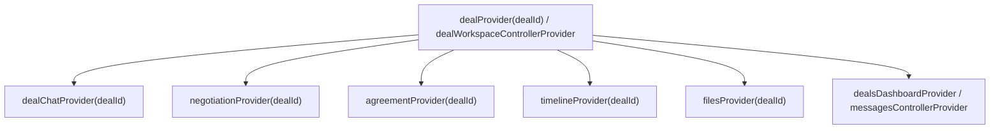

# ⚡ شجرة وتبعية المزودات (Provider Flow & Reactive Dependencies)
## تطبيق نسيجي للموردين — NASEEJI Supplier App

---

## 📌 مخطط التبعية الرأسية الموحدة (Single Source Provider Hierarchy)

---

## 🔁 آلية التحديث التفاعلي بدون إغلاق أو إعادة تحميل (Reactive Riverpod Flow)

1. عند النقر على زر التعديل أو قبول العرض، يتم استدعاء `ref.read(dealProvider(dealId).notifier).submitNewOfferVersion(...)`.
2. الكنترولر يحدّث كائن الـ `Deal` المركزي داخل `MockDatabase`.
3. تقوم خاصية `ref.watch(dealProvider(dealId).select(...))` بإرسال إشارة إعادة بناء **حصرية للـ Widgets المستمعة فقط** (Header, Negotiation Card, System Message, Timeline Milestone).
4. عدم إعادة تحميل الصفحات أو استدعاء APIs إضافية ⬅️ **أقصى سرعة وأفضل أداء سلس بدون flickering.**
