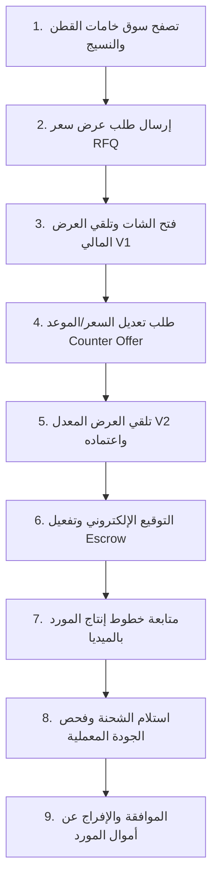

# 🏭 رحلة المصنع والمشتري (Factory User Journey Documentation)
## منصة نسيجي — NASEEJI B2B Platform

---

## 📌 مخطط رحلة المصنع الكاملة (Factory Journey Map)

---

## 📋 المراحل التفصيلية لرحلة المصنع

1. **استكشاف السوق وإرسال RFQ**:
   يحدد المصنع نوع الخامة المطلوبة، الكمية، والمدينة. يتم توليد `Deal` و `Chat` آلياً لدى المورد.

2. **التفاوض والـ Counter Offer**:
   يتلقى المصنع بطاقة العرض المنظمة `Version 1`. يمكنه النقر على "طلب تعديل" لتقديم سعر مضاد، مما يحول الحالة إلى `Counter Offer`.

3. **التوقيع والإفراج النهائي**:
   عند النقر على "قبول العرض"، يتم توقيع العقد، وربط المحفظة بالحساب الضامن Escrow. بعد استلام الشحنة وفحص الجودة، يتم تحويل المبلغ للمورد وإغلاق الصفقة.
