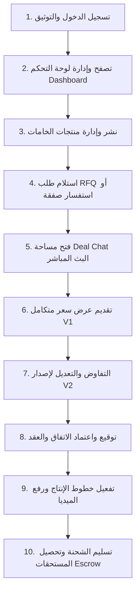

# 👤 رحلة المورد (Supplier User Journey Documentation)
## تطبيق نسيجي للموردين — NASEEJI Supplier App

---

## 📌 مخطط رحلة المورد الكاملة (Supplier Journey Map)

---

## 🚀 المراحل التفصيلية لرحلة المورد

### المرحلة 1: تسجيل الدخول والتوثيق
- **ما يراه المورد**: شاشة الدخول ورقم الهاتف والرمز السري وتأكيد الهوية الهيكلية.
- **في الخلفية**: فحص صلاحيات المورد ومزود الجلسة `sessionProvider`.

### المرحلة 2: لوحة التحكم والمنتجات
- **ما يراه المورد**: ملخص الصفقات، عدد طلبات RFQ، إحصائيات المبيعات، وقائمة المنتجات الخامات.
- **في الخلفية**: جلب `MockDatabase.products` و `MockDatabase.deals`.

### المرحلة 3: استلام الطلب وتفاوض الصفقة
- **ما يراه المورد**: إشعار بدخول طلب جديد، الضغط عليه يفتح **`BusinessChatScreen`** مباشرة بالتبويبات الـ 5 وشريط الـ Sticky Header.
- **في الخلفية**: جلب حالة الصفقة الموحدة من `dealProvider(dealId)`.

### المرحلة 4: تقديم وتعديل العروض
- **ما يراه المورد**: نافذة `RequestModificationBottomSheet` لإدخال السعر، الكمية، مدة الإنتاج، وشروط التسليم.
- **في الخلفية**: فحص الملاحظات بمحرك الأمان، وإنشاء إصدار جديد `Version N+1` وتحديث حالة `MockDatabase`.

### المرحلة 5: التوقيع، التصنيع، واستلام المستحقات
- **ما يراه المورد**: تفعيل تبويب الاتفاق، رفع مقاطع فيديو وصور للإنتاج، ومتابعة إيداع الأرباح بحساب الضامن Escrow.
